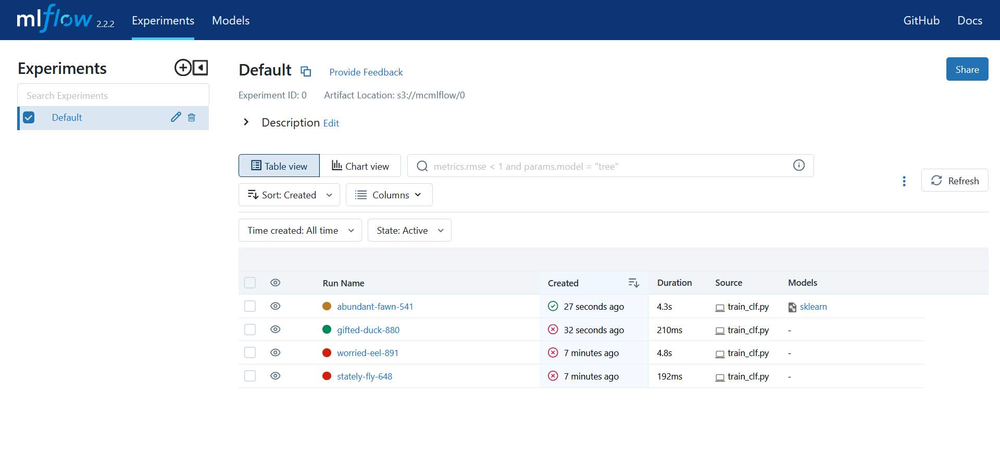
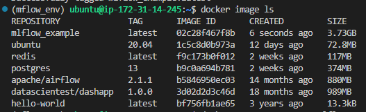
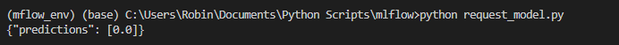

# MC_MLflow
Codes necessaires MC MLFlow (jeu de données peut pas être load sur le github : hr_train_corrupted.csv)
## Partie 1 : rediriger Artifact vers bucket s3 AWS
- Installer [AWS CLI](https://docs.aws.amazon.com/cli/latest/userguide/getting-started-install.html#cliv2-linux-install) pour stocker les identifiants de connexion au s3 de AWS.
- [aws configure](https://docs.aws.amazon.com/cli/latest/userguide/getting-started-quickstart.html)

- [Installer un environnement virtuel](https://docs.python.org/3/library/venv.html) avec `mlflow_requirements.txt`

- La VM avec Mlflow qui tourne dessus VM_Emilie: 34.248.235.26 (changer par l'adresse IP de la VM) http://34.248.235.26:5000/

- Lancer le serveur mlflow pour pouvoir enregistrer des artifacts depuis une autre VM : mlflow server -h 0.0.0.0 --default-artifact-root s3://mcmlflow

- Dans une autre VM ou machine locale (vm_antoine) 18.200.193.78, il y a le fichier train_clf.py et le jeu de données, vous devrez le récupérez et les mettre dans votre machine

- Créer puis Activer environnement virtuel
python -m venv mlflowenv
mlflowenv\Scripts\activate

- Installer requirements pip install -r requirements.txt 

- Répéter installation + configuration AWS CLI
- Verifier installation aws --version

- Faire tourner entrainement en local : python3 train_clf.py 

- En variant les paramètres d'entrainement python3 train_clf.py gini 5

- Pour ensuite rediriger artifact vers serveur hist depuis vm_emilie et les stocker sur un bucket s3 (installer extension aws)

- Il faut juste préciser dans votre fichier python (dans vm_antoine)  mlflow.set_tracking_uri("http:34.248.235.26:5000") dans le fichier `train_clf.py`, il y a un setup à faire mais vous allez pas le faire en détail, il se trouve dans [l'article](https://towardsdatascience.com/how-to-use-mlflow-on-aws-to-better-track-machine-learning-experiments-bbcb8acded65)

- Vérifier via l'interface mlflow Ui et se rendre sur le [bucket s3 renseigné](https://s3.console.aws.amazon.com/s3/buckets/mcmlflow?region=eu-west-3&tab=objects) pour vérifier que le modèle est bien stocké.

## Partie 2 : Déploiement modele de ML à partir de versions stockées sur le s3

- Alors avec la commande suivante pour créer image docker (changer le dossier/nom du modèle enregistré dans le s3) : 

- mlflow models build-docker -m "s3://mcmlflow/0/a46036eaa31e4719a8275ee8a20c1c3a/artifacts/model_gini_None/" -n container_name

- Puis on lance le conteneur : 

- docker run -p 5001:8080 container_name

- je crée des conteneurs mais j'ai pas encore réussi à les requêter, il faudrait voir [ce lien](https://mlflow.org/docs/latest/models.html#deploy-mlflow-models) et [celui-là](https://mlflow.org/docs/latest/cli.html#mlflow-models-build-docker)

- Je vais continuer à me pencher dessus mais je pense que c'est bien que vous commencez à récup les fichiers et différentes questions que vous aurez

- une fois le conteneur lancé on peu lancer la requête depuis la même VM où le conteneur est lancé :

curl http://18.200.193.78:5001/invocations -H 'Content-Type: application/json' -d '{
  "dataframe_records": [{
    "satisfaction_level":0.61,
    "last_evaluation":0.6,
    "number_projects":2.0,
    "average_monthly_hours":152.3,
    "time_spend_company":2.0,
    "work_accident":0.0,
    "promotion_last_5_years":0.0,
    "position":"technical",
    "salary":2
}]
}'

- Ou depuis une autre VM : 
curl http://127.0.0.1:5001/invocations -H 'Content-Type: application/json' -d '{
  "dataframe_records": [{
    "satisfaction_level":0.61,
    "last_evaluation":0.6,
    "number_projects":2.0,
    "average_monthly_hours":152.3,
    "time_spend_company":2.0,
    "work_accident":0.0,
    "promotion_last_5_years":0.0,
    "position":"technical",
    "salary":2
}]
}'

On peut aussi lancer des requêtes url depuis script python (avec librairie requests) => fichier request_model.py

